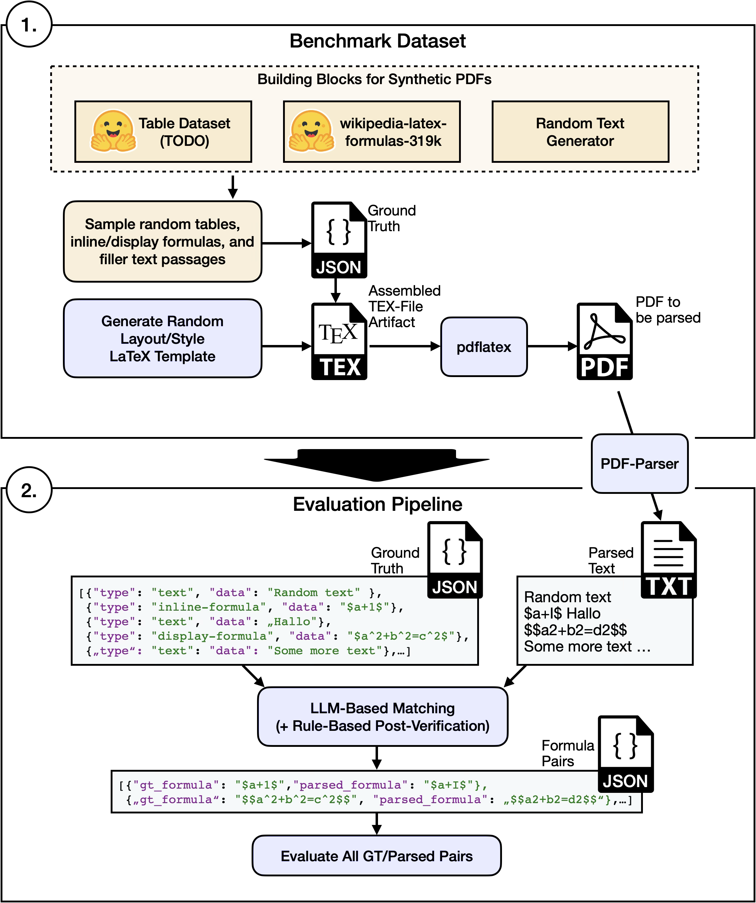
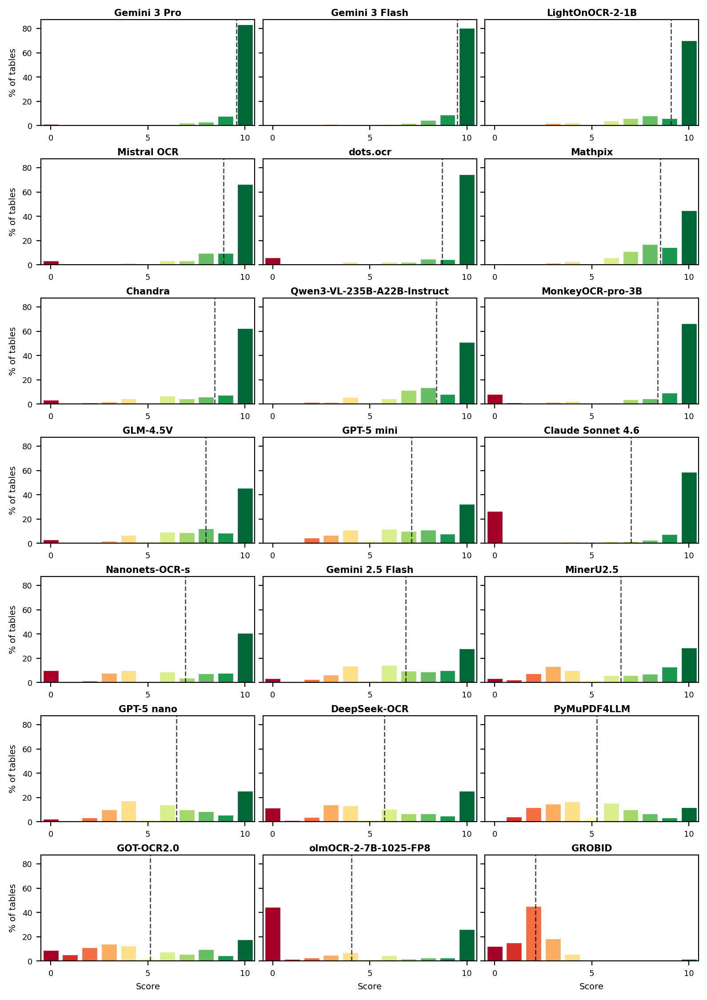

# PDF Parse Bench

This benchmark evaluates how effectively different PDF parsing solutions extract mathematical formulas and tables from documents. We generate synthetic PDFs with diverse formatting scenarios, parse them with different parsers, and score the extracted content using **LLM-as-a-Judge**. This semantic evaluation approach [substantially outperforms traditional metrics](#why-llm-as-a-judge) in agreement with human judgment.



## 🏆 Leaderboard (2026-q1)

Results are based on two separate benchmark datasets, each containing 100 synthetic PDFs:
- **`2026-q1-tables-only`** — PDFs with tables of varying complexity (simple, moderate, complex)
- **`2026-q1-formulas-only`** — PDFs with inline and display-mode mathematical formulas

| Parser | Tables | Formulas | Cost/Time | Inference |
|--------|--------|----------|-----------|-----------|
| [Gemini 3 Flash](https://deepmind.google/models/gemini/flash/) | 9.50 | 9.79 | $0.57 | API |
| [LightOnOCR-2-1B](https://huggingface.co/lightonai/LightOnOCR-2-1B) | 9.08 | 9.57 | 30 min | GPU |
| [Mistral OCR](https://mistral.ai/) | 8.89 | 9.48 | $0.20 | API |
| [dots.ocr](https://github.com/rednote-hilab/dots.ocr) | 8.73 | 9.55 | 20 min | GPU |
| [Mathpix](https://mathpix.com/) | 8.53 | 9.66 | $0.35–0.50 | API |
| [Chandra](https://huggingface.co/datalab-to/chandra) | 8.43 | 9.45 | 4 h | GPU |
| [Qwen3-VL-235B](https://github.com/QwenLM/Qwen3-VL) | 8.43 | 9.84 | $0.20 | API/GPU |
| [MonkeyOCR-pro-3B](https://github.com/Yuliang-Liu/MonkeyOCR) | 8.39 | 9.50 | 20 min | GPU |
| [GLM-4.5V](https://github.com/zai-org/GLM-V) | 7.98 | 9.37 | $0.60 | API |
| [GPT-5 mini](https://openai.com/) | 7.14 | 5.57 | $1.00 | API |
| [Claude Sonnet 4.6](https://docs.anthropic.com/en/docs/about-claude/models) | 7.02 | 8.50 | $3.00 | API |
| [Nanonets-OCR-s](https://huggingface.co/nanonets/Nanonets-OCR-s) | 6.92 | 9.21 | 50 min | GPU |
| [PP-StructureV3](https://github.com/PaddlePaddle/PaddleOCR) | 6.86 | 9.59 | 3 min | GPU |
| [Gemini 2.5 Flash](https://deepmind.google/models/gemini/flash/) | 6.85 | 6.51 | $0.40 | API |
| [MinerU2.5](https://mineru.net/) | 6.49 | 9.32 | varies | API/GPU |
| [GPT-5 nano](https://openai.com/) | 6.48 | 4.78 | $0.35 | API |
| [DeepSeek-OCR](https://github.com/deepseek-ai/DeepSeek-OCR) | 5.75 | 8.97 | 4 min | GPU |
| [PaddleOCR-VL](https://huggingface.co/PaddlePaddle/PaddleOCR-VL-1.5) | 5.39 | 8.47 | 2.5 h | GPU |
| [PyMuPDF4LLM](https://github.com/pymupdf/PyMuPDF4LLM) | 5.25 | 4.53 | 30 s | CPU |
| [GOT-OCR2.0](https://github.com/Ucas-HaoranWei/GOT-OCR2.0) | 5.13 | 8.01 | 20 min | GPU |
| [olmOCR-2-7B](https://github.com/allenai/olmocr) | 4.05 | 9.35 | 25 min | GPU |
| [GROBID](https://github.com/kermitt2/grobid) | 2.10 | 7.01 | 2 min | CPU |

**Legend:**
- **Tables**: Average LLM-as-a-Judge score (0-10) across 451 tables from `2026-q1-tables-only`
- **Formulas**: Average LLM-as-a-Judge score (0-10) across 1413 inline + 657 display formulas from `2026-q1-formulas-only`
- **Cost/Time**: API cost (USD) for 100 pages, or GPU wall-clock time on a single NVIDIA RTX 4090
- **Inference**: Deployment options (CPU, GPU, API)

<details>
<summary>📊 Detailed table scores (Simple/Moderate/Complex)</summary>

| Rank | Parser | Overall | Simple | Moderate | Complex |
|------|--------|---------|--------|----------|---------|
| 1 | Gemini 3 Flash | 9.50 | 9.53 | 9.38 | 9.61 |
| 2 | LightOnOCR-2-1B | 9.08 | 9.41 | 8.90 | 8.91 |
| 3 | Mistral OCR | 8.89 | 8.92 | 8.69 | 9.07 |
| 4 | dots.ocr | 8.73 | 9.01 | 8.43 | 8.76 |
| 5 | Mathpix | 8.53 | 9.32 | 8.40 | 7.77 |
| 6 | Chandra | 8.43 | 8.96 | 8.14 | 8.15 |
| 7 | Qwen3-VL-235B | 8.43 | 9.23 | 8.27 | 7.67 |
| 8 | MonkeyOCR-pro-3B | 8.39 | 8.60 | 8.10 | 8.47 |
| 9 | GLM-4.5V | 7.98 | 9.19 | 7.59 | 7.00 |
| 10 | GPT-5 mini | 7.14 | 8.03 | 6.82 | 6.48 |
| 11 | Claude Sonnet 4.6 | 7.02 | 6.94 | 7.10 | 7.01 |
| 12 | Nanonets-OCR-s | 6.92 | 8.27 | 6.51 | 5.82 |
| 13 | PP-StructureV3 | 6.86 | 7.44 | 6.16 | 6.96 |
| 14 | Gemini 2.5 Flash | 6.85 | 7.93 | 6.52 | 5.94 |
| 15 | MinerU2.5 | 6.49 | 7.07 | 6.03 | 6.35 |
| 16 | GPT-5 nano | 6.48 | 7.63 | 6.18 | 5.47 |
| 17 | DeepSeek-OCR | 5.75 | 7.45 | 5.34 | 4.20 |
| 18 | PaddleOCR-VL | 5.39 | 6.81 | 5.02 | 4.17 |
| 19 | PyMuPDF4LLM | 5.25 | 6.78 | 4.86 | 3.91 |
| 20 | GOT-OCR2.0 | 5.13 | 5.89 | 4.95 | 4.45 |
| 21 | olmOCR-2-7B | 4.05 | 4.64 | 3.78 | 3.68 |
| 22 | GROBID | 2.10 | 2.27 | 1.94 | 2.09 |

- **Overall/Simple/Moderate/Complex**: LLM-as-a-Judge score (0-10 scale) across 451 tables by complexity level

</details>

<details>
<summary>📊 Table score distributions</summary>



</details>

<details>
<summary>📊 Detailed formula scores (Inline/Display)</summary>

| Rank | Parser | Inline | Display |
|------|--------|--------|---------|
| 1 | Qwen3-VL-235B | 9.82 | 9.86 |
| 2 | Gemini 3 Flash | 9.77 | 9.82 |
| 3 | Mathpix | 9.64 | 9.72 |
| 4 | PP-StructureV3 | 9.49 | 9.80 |
| 5 | LightOnOCR-2-1B | 9.51 | 9.70 |
| 6 | dots.ocr | 9.44 | 9.77 |
| 7 | MonkeyOCR-pro-3B | 9.54 | 9.42 |
| 8 | Mistral OCR | 9.39 | 9.68 |
| 9 | Chandra | 9.43 | 9.50 |
| 10 | GLM-4.5V | 9.33 | 9.46 |
| 11 | olmOCR-2-7B | 9.34 | 9.37 |
| 12 | MinerU2.5 | 9.36 | 9.25 |
| 13 | Nanonets-OCR-s | 9.18 | 9.26 |
| 14 | DeepSeek-OCR | 8.95 | 9.02 |
| 15 | Claude Sonnet 4.6 | 8.42 | 8.67 |
| 16 | PaddleOCR-VL | 8.50 | 8.42 |
| 17 | GOT-OCR2.0 | 7.77 | 8.53 |
| 18 | GROBID | 7.33 | 6.33 |
| 19 | Gemini 2.5 Flash | 6.47 | 6.58 |
| 20 | GPT-5 mini | 5.87 | 4.94 |
| 21 | GPT-5 nano | 4.88 | 4.57 |
| 22 | PyMuPDF4LLM | 6.50 | 0.29 |

- **Inline**: LLM-as-a-Judge score for inline formulas (1413 formulas)
- **Display**: LLM-as-a-Judge score for display-mode formulas (657 formulas)

</details>

## Why LLM-as-a-Judge?

Rule-based metrics correlate poorly with human judgment for formula and table extraction. We validated this in two human annotation studies (Pearson r = correlation with human scores):

- **[formula-metric-study](https://github.com/phorn1/formula-metric-study)** — 750 human ratings: text metrics reach r = 0.01, CDM r = 0.31, LLM judges r = 0.74–0.82
- **[table-metric-study](https://github.com/phorn1/table-metric-study)** — 1,500+ human ratings: rule-based metrics (TEDS, GriTS) top out at r = 0.70, LLM judges reach r = 0.94

## Benchmark Datasets

PDFs are generated synthetically using LaTeX with randomized parameters (document class, fonts, margins, column layout, line spacing) to test parser robustness across different formatting scenarios. Since PDFs are generated from LaTeX source, we automatically obtain exact ground truth as a byproduct of the generation process.

- **Formula Dataset:** Each PDF contains randomly selected formulas embedded in text passages, displayed as inline or display-mode equations. Formulas are sampled from our dataset of 319,000 formulas extracted from Wikipedia, ensuring diversity in complexity and real-world relevance. Dataset: [piushorn/wikipedia-latex-formulas-319k](https://huggingface.co/datasets/piushorn/wikipedia-latex-formulas-319k)

- **Table Dataset:** Each PDF contains tables of varying complexity (simple, moderate, complex) with diverse content types, column layouts, and formatting. Dataset coming soon on Hugging Face.

## Evaluation Pipeline

Parser outputs are assessed using a two-step pipeline:

### Step 1: Extraction

Given a parser's output (the extracted text from a PDF), an LLM establishes initial correspondences between extracted elements and ground truth (formulas or tables), then fuzzy search reliably extracts exact strings from the parsed output. This achieves robust alignment even when parser outputs differ significantly from ground truth.

### Step 2: Scoring with LLM-as-a-Judge

The primary metric is the **LLM-as-a-Judge score** (0-10 scale, default: Gemini 3 Flash via OpenRouter). For **formulas**, the judge evaluates correctness, completeness, and semantic equivalence. For **tables**, the judge evaluates content accuracy and structure preservation. Scores are computed separately for inline/display formulas and by table complexity (simple/moderate/complex). See [Why LLM-as-a-Judge?](#why-llm-as-a-judge) for our validation studies.

## Quick Start

**Benchmark Datasets:** New benchmark datasets are released quarterly, each containing 100 PDFs. The current datasets are `2026-q1-tables-only` (tables) and `2026-q1-formulas-only` (formulas).

There are two ways to use this benchmark, depending on your needs:

### Option 1: Evaluate Your Existing Parser (pip install)

**Use this if:** You quickly want to evaluate your PDF Parsing tool against the benchmark.

**Advantage:** Simple pip install, no need to integrate with the repository structure.

#### Installation

```bash
pip install pdf-parse-bench
```

**Note:** Set `OPENROUTER_API_KEY` environment variable for evaluation (used for LLM-as-a-Judge scoring via [OpenRouter](https://openrouter.ai/)).

#### Step 1: Parse the Benchmark PDFs

Get the benchmark PDFs and parse them with your parser:

```python
from pdf_parse_bench import get_benchmark_pdfs_dir
from pathlib import Path

# Get benchmark PDFs (included in the package)
pdfs_dir = get_benchmark_pdfs_dir()

# Parse each PDF with your parser
output_dir = Path("results/my_parser")
for pdf_path in pdfs_dir.glob("*.pdf"):
    # Parse PDF with your parser
    parsed_text = your_parser.parse(pdf_path)

    # Save to expected format: {output_dir}/{pdf_name}/parsed.md
    (output_dir / pdf_path.stem / "parsed.md").parent.mkdir(parents=True, exist_ok=True)
    (output_dir / pdf_path.stem / "parsed.md").write_text(parsed_text)
```

**Required output structure:**
```
results/my_parser/
├── 000/
│   └── parsed.md
├── 001/
│   └── parsed.md
├── 002/
│   └── parsed.md
...
```

#### Step 2: Run Evaluation

Run the benchmark evaluation on your parsed results:

```python
from pathlib import Path
from pdf_parse_bench import Benchmark, PDFParser, get_benchmark_ground_truth_dir

class MyParser(PDFParser):
    @classmethod
    def display_name(cls) -> str:
        return "My Parser"

    def parse(self, pdf_path: Path, output_path: Path) -> str:
        raise NotImplementedError  # Already parsed in Step 1

bench = Benchmark(
    parser_output_dir=Path("results/my_parser"),
    ground_truth_dir=get_benchmark_ground_truth_dir(),
    llm_judge_models=["google/gemini-3-flash-preview"],
    parser=MyParser(),
)
bench.extract()
bench.evaluate()
bench.save_benchmark_summary()
```

---

### Option 2: Add Parser to Repository (for reproducibility)

**Use this if:** You want to contribute your parser to the benchmark, reproduce published results, or ensure full reproducibility of your evaluation setup.

**Advantage:** Full automation with CLI, parser configuration is versioned and reproducible, easy to share exact setup with others.

#### Clone Repository

```bash
git clone https://github.com/phorn1/pdf-parse-bench.git
cd pdf-parse-bench

# Install with uv
uv sync

# Configure environment (copy and edit .env.example)
cp .env.example .env
```

#### Add Your Parser Implementation

Create a new parser module in the `parsers/` directory:

```python
# parsers/my_parser/__main__.py
from pathlib import Path
from pdf_parse_bench.utilities import PDFParser
from pdf_parse_bench.pipeline import run_cli

class MyParser(PDFParser):
    @classmethod
    def display_name(cls) -> str:
        return "My Parser"

    def parse(self, pdf_path: Path, output_path: Path) -> str:
        # Your parsing logic here
        markdown = "# Parsed content"
        self._write_output(markdown, output_path)
        return markdown

if __name__ == "__main__":
    run_cli(MyParser())
```

#### Run Your Parser

```bash
uv run -m parsers.my_parser
```

The benchmark infrastructure handles everything automatically:
- Loading test PDFs from `data/<dataset>/pdfs/`
- Parsing each PDF with your parser
- Extracting formulas from parsed output
- Running evaluation against ground truth
- Saving results in standardized format

## CLI Options

The benchmark CLI provides several options to customize execution:

```bash
# Run only specific steps
uv run -m parsers.my_parser --step parse
uv run -m parsers.my_parser --step extract --step evaluate

# Reprocess existing results
uv run -m parsers.my_parser --reprocess all
uv run -m parsers.my_parser --reprocess parse --reprocess extract

# Use a different LLM judge for evaluation (OpenRouter model format)
uv run -m parsers.my_parser --llm-judge-model openai/gpt-5-mini

# Custom input/output directories
uv run -m parsers.my_parser -i data/2026-q1-tables-only -o results/custom
```

## Project Structure

```
pdf-parse-bench/
├── src/pdf_parse_bench/       # Core benchmark infrastructure
│   ├── pipeline/              # Benchmark execution pipeline
│   ├── eval/                  # Evaluation metrics and judges
│   ├── extraction/            # Formula extraction from parsed text
│   ├── utilities/             # Base classes and helpers
│   └── synth_pdf/             # Synthetic PDF generation (optional)
├── parsers/                   # Parser implementations
│   ├── pymupdf4llm/
│   ├── llamaparse/
│   ├── mathpix/
│   └── ...                    # Add your own!
├── data/                      # Benchmark datasets
│   ├── 2026-q1-tables-only/  # Table benchmark dataset
│   │   ├── pdfs/
│   │   └── ground_truth/
│   └── 2026-q1-formulas-only/ # Formula benchmark dataset
│       ├── pdfs/
│       └── ground_truth/
```

## Contributing

Contributions are welcome!

**Adding a parser implementation:** See [Option 2](#option-2-add-parser-to-repository-for-reproducibility) above for instructions on adding your parser to the repository.

**Bug reports and feature requests:** Please open an issue on GitHub.

## License

This project is licensed under the MIT License - see the [LICENSE](LICENSE) file for details.

## Citation

If you use this benchmark in your research or project, please cite our paper:

```bibtex
@misc{horn2025benchmarking,
    title = {Benchmarking Document Parsers on Mathematical Formula Extraction from PDFs},
    author = {Horn, Pius and Keuper, Janis},
    year = {2025},
    eprint={2511.10390},
    archivePrefix={arXiv},
    primaryClass={cs.CV},
    url = {https://arxiv.org/abs/2512.09874}
}
```

📄 **Paper:** [arXiv:2512.09874](https://arxiv.org/abs/2512.09874)

## Acknowledgments
This work has been supported by the German Federal Ministry of Research, Technology and Space (BMFTR) in the program "Forschung an Fachhochschulen in Kooperation mit Unternehmen (FH-Kooperativ)" within the joint project **LLMpraxis** under grant 13FH622KX2.

<p align="center">
  
  
</p>
